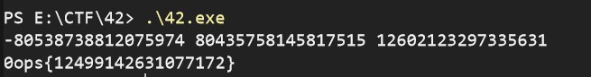

# 42
这道题给了一个Windows下的可执行文件，我们使用IDA反编译软件打开。

找到main函数之后，按下 `F5` 反编译为C语言。根据代码中的函数名称，大概可以推出其内容：
> 输入三个数字，并且计算它们的乘方，并将它们加和。

``` c
fmt_Fscanf(
    a1,
    a2,
    a3,
    (__int64)&go_itab__os_File_io_Reader,
    a5,
    a6,
    (__int64)&go_itab__os_File_io_Reader,
    os_Stdin,
    (__int64)&aAaeeffiIillmsn[1903],
    8LL);
  math_big___Int__SetInt64(a1, a2, v6);
  math_big___Int__SetInt64(a1, a2, (__int64)&v79);
  math_big___Int__Exp(a1, a2, v7, v40, v11);
  math_big___Int__Exp(a1, a2, v7, v38, v15);

  math_big___Int__Exp(a1, a2, v7, v37, v19);
  v34 = &v85;
  v46 = 0;
  v47 = 0LL;
  v48 = 0LL;
  math_big___Int__SetInt64(a1, a2, v20);
  v39 = v7;
  math_big___Int__Add(a1, a2, v21, (__int64)v35);
  v22 = (__int64)v34;
  math_big___Int__Add(a1, a2, v23, (__int64)v34);
  runtime_newobject(a1, a2);
  math_big___Int__SetInt64(a1, a2, v24);
  v41 = v22;
  math_big___Int__Add(a1, a2, v25, v38);
  v26 = v37;
  math_big___Int__Add(a1, a2, v27, v37);
  // 部分内容被省略，仅显示重要部分代码。
  ```

那么，联想到前段时间的新闻：
[刚刚，42也被人类写成了三个整数的立方和！](http://www.sohu.com/a/339265848_107944)

那么这道题的思路是不是很明显了呢？

我们尝试将这三个数字：
```
-80538738812075974
80435758145817515
12602123297335631
```
输入程序，以空格隔开，得到flag：
