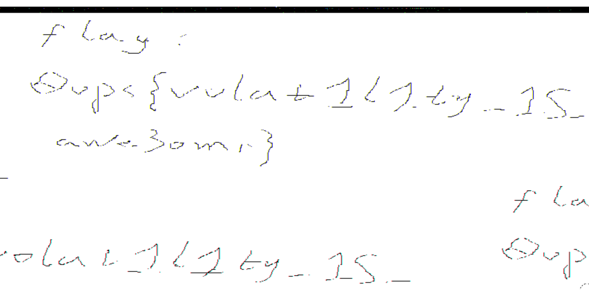

# anti-hack01
这道题给了一个hint：
```
Hint1: Absolutely you cant handle it by yourself without some tools...
```
这个就明示了我们可以用一些工具来解决这道题。

根据前人的writeup，我们可以看到一些神奇的内容，有一个叫做`Volatility`的神奇工具可以帮助我们分析内存中的内容。

在[已有的WriteUp](https://www.freebuf.com/news/145262.html)中我们可以看到使用该工具的详细方法。仿照这个内容，可以提取出用户使用程序的内容。发现了有一个叫做"mspaint.exe"的程序非常可疑，其PID为2768，考虑黑客可能在这个程序里面记录了flag。

使用`volatility -f mem.data memdump -p 2768 --dump-dir=./`将该程序的内容dump出来，根据网上的方法，使用图片查看器Gimp将该内容以“原始图像数据”方式打开。打开后需要选择图片的尺寸，经过不断尝试，我将其修改为`1920×1080`，打开后可以看到黑客在里面绘制非常模糊的flag。

