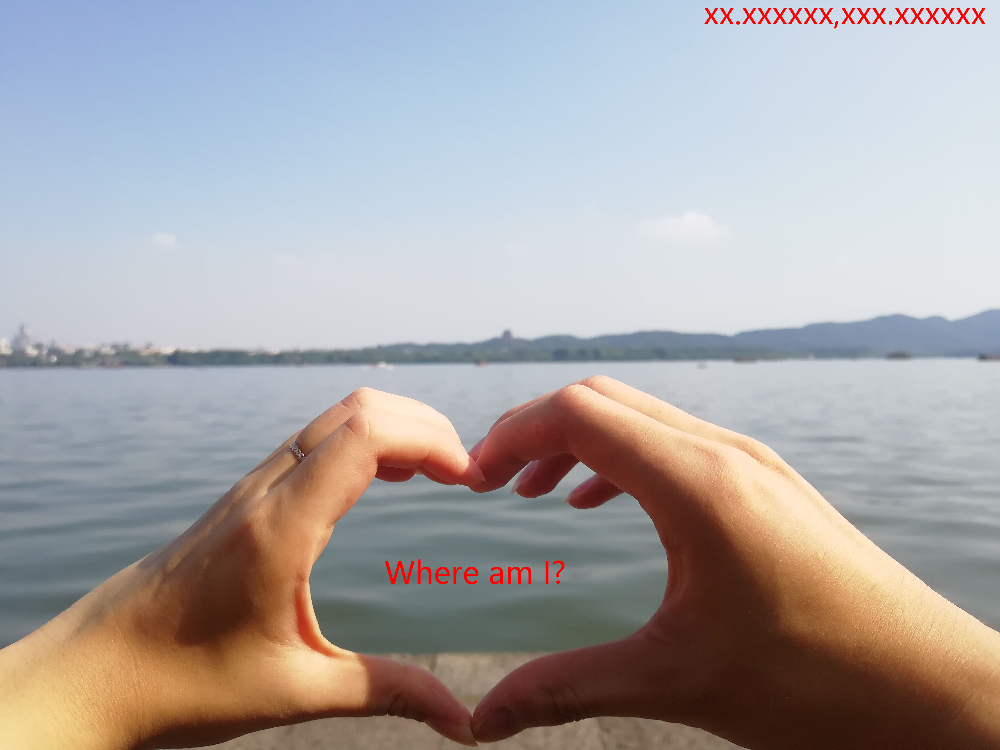

# dog
这道题给了一个压缩包，解压后发现需要密码。于是使用Hex Editor打开该压缩包，看到了里面的`flag.txt0ops{fake_flag_lol}`。由于其直接显示了文件内容，考虑使用伪加密，将zip加密标志位改为0，即可正常解压得到文件内容。

解压完成后得到了一个zip，但是仍然需要密码，再次使用Hex Editor打开，发现在文件的末尾有一串异常的多余字符。由`=`结尾且全部为大写，考虑为base32编码。使用在线解码器解码后，得到了密码，使用密码解开zip。

解开zip之后发现了一大堆文件，其中第一个文件`flagaa`的文件头为jpg文件头，考虑使用Python将这些文件拼接。拼接完成之后，出现了一张图片。

图片的内容为: `Where am I?`，右上角给了一点提示：`XX.XXXXXX,XXX.XXXXXX` 。看起来像是经纬度坐标，右键属性查看文件细节，看到了图片中包含的坐标。

使用binwalk分析jpg，发现尾部隐藏了一个zip压缩包，使用foremost分离文件，得到一个zip，但是需要解压密码。于是考虑使用经纬度坐标作为密码输入进去，但是发现不对。后来尝试了很久，发现右键属性里面给出的坐标是按“度、分、秒”计算的，而不是按正常的十进制计算的。于是用计算器把它转成十进制再输入，就可以正常解压了。

解压之后又得到了一个需要密码的压缩包，用Hex Editor打开之后发现文件末尾提示作者使用了他的QQ号码作为密码。由于QQ号长度范围有限，且均为数字，经过一番思考，决定使用爆破的方法破解密码。

丢到服务器上用破解神器`JohnTheRipper`破解密码:
```
./john --enc=digits flag.zip
```
大概过了一个小时之后，发现已经破解好了，运行：
```
./john --show flag.zip
```
得到破解出来的密码，解压得到如下的图片：


可以看到图中的横线应该就是flag的内容了，使用肉眼可以看到开头的几个字母`0ops`。在这里使用图片隐写破解神器`StegSolve`打开图片，通过按动左右按钮，多次尝试后可以清晰地看到flag的内容。