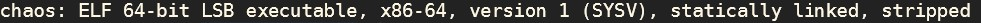
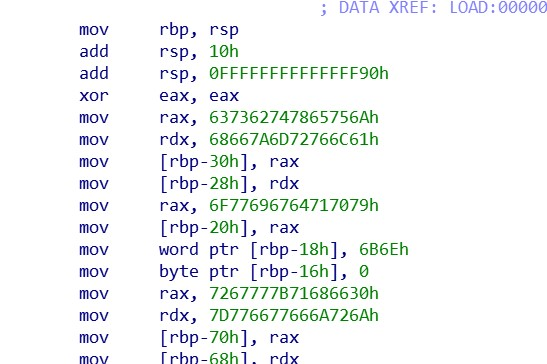

# chaos
首先，使用`file chaos`指令，可以看到如下的内容：

发现这是一个ELF64文件，我们用IDA打开进行反编译。打开之后，发现有一些内容十分可疑：

右键之后发现这是一些字符串。然后通过对汇编代码进行分析，我们发现这道题的本质是一个加密的问题。
这里一共有两个字符串，其中一串是加密后的密文，另外一串是一张“字母对应表”，在对应表中寻找密文中的字母，其在对应表中的位置，即为该字母在字母表中的位置。手动解密后即可得到flag。